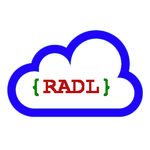

# RADL

* [What is RADL 2.0?](#What_is_RADL)
* [Getting help](#Getting help)
* [License](#License)

The rest of this page describes RADL 2.0 as we currently envision it. Differences between the RADL 2.0 requirements and RADL 1.0 will be spelled out.  

## <a name="What_is_RADL"/> What is RADL? ##

*RESTful API Description Language* (RADL) is a vocabulary for describing Hypermedia-driven RESTful APIs.  Unlike most HTTP API description languages, RADL focuses on defining a truly hypermedia-driven REST API from the client's point of view (instead of describing the server-side implementation).

RADL 2.0 will make significant changes to RADL, and will not be backwards compatible.  RADL 2.0 is in early planning, and is not yet ready to use.  Please use [RADL 1.0](https://github.com/restful-api-description-language/RADL/) for now.  This page will be updated
as our status changes.  We do not anticipate significant development on RADL 1.0 moving forward, since we are shifting our resources to RADL 2.0.

The major changes we envision:

* RADL 2.0 has a simpler model, based on documents (representations), links (identified by link relations), and operations on those links. In RADL 2.0, states and transitions are no longer part of the model.  We are making this change to (1) provide a simpler and more concrete approach to modeling, and (2) support generation of RADL descriptions from message logs.
* RADL 2.0 will use JSON to describe structured content, XML or HTML for document-oriented documentation, and identifiers to allow them to reference each other.  RADL 1.0 uses XML for both structured content and document-oriented documentation.
* RADL 2.0 will no longer attempt to parse source code. For development-first environments, we will provide tools that create message logs, then convert those message logs into RADL descriptions. Design-first environments will still be supported in the same way as RADL 1.0. If we need information extracted from source code, we will rely on existing tools that do this, and extract the information we need from WADL or Open API.

## Talk to us ##

RADL 2.0 is an open source project. If you need help, would like to contribute, or simply
want to talk about the project with like-minded individuals, please get in touch.

* To report bugs or file feature requests: please use the [issue tracker on Github](https://github.com/restful-api-description-language/RADL-2.0/issues).
* To contribute code or documentation changes: please submit a [pull request on Github](https://github.com/restful-api-description-language/RADL-2.0/pulls).

## <a name="License"/> License ##

Copyright � EMC Corporation. All rights reserved. EMC grants rights under the Apache 2.0 license.
See the [`LICENSE`](https://raw.githubusercontent.com/restful-api-description-language/RADL/master/LICENSE) file for more information.
